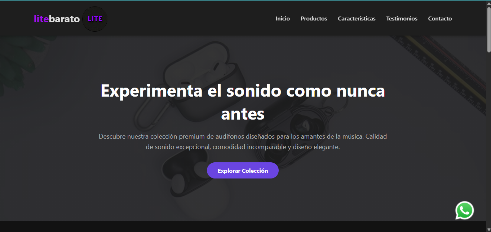
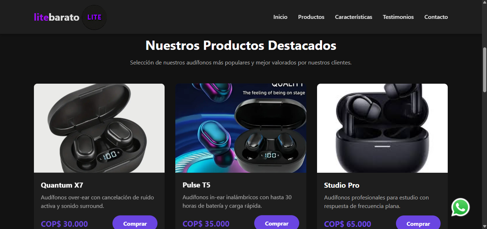
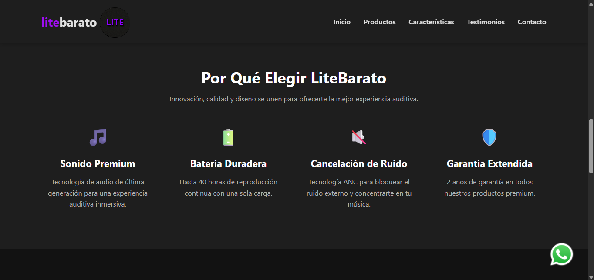
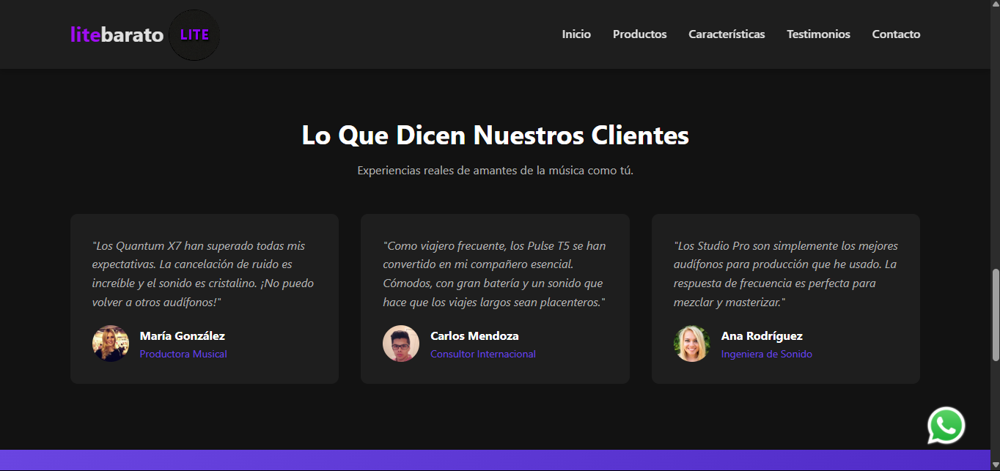
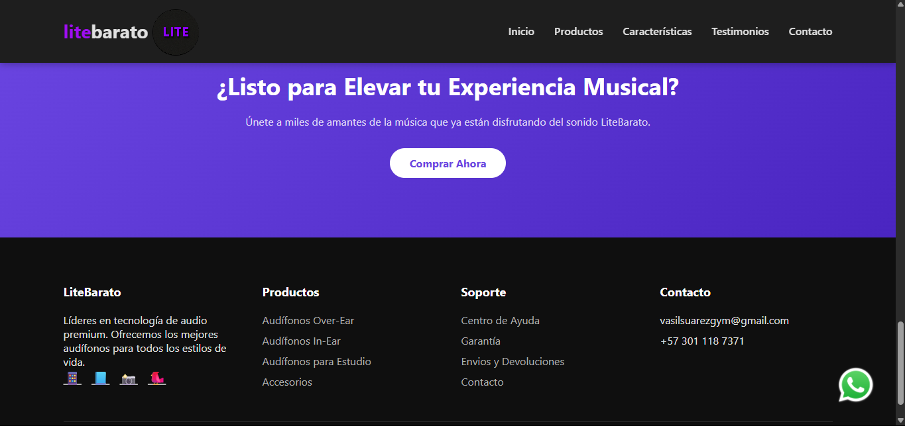

# Lending Tienda de Audífonos 

Este proyecto es una **landing page** diseñada para promocionar un modelo específico de audífonos.- La página destaca las características del producto, su precio y una galería con imágenes llamativas. Ideal para usarse en campañas publicitarias, redes sociales o portafolios personales.


##  Tecnologías utilizadas

- HTML5
- CSS3

- 
##  Cómo visualizarlo

No requiere instalación. Solo abre el archivo `principal.html` en tu navegador favorito.

```bash
# Clona el repositorio
git clone https://github.com/vasil-bit/tienda-audifonos.git

# Entra a la carpeta
cd tienda-audifonos

# Abre el archivo HTML
start principal.html      # En Windows
open principal.html       # En Mac
xdg-open principal.html   # En Linux
```

## Capturas







 mire la demo de la pagina https://youtu.be/1rNmzu-6EUs?si=HrMFAZkmVqDpYWJr
 
## 👤 Autor

Desarrollado por [Vasil](https://github.com/vasil-bit) — 2025.
